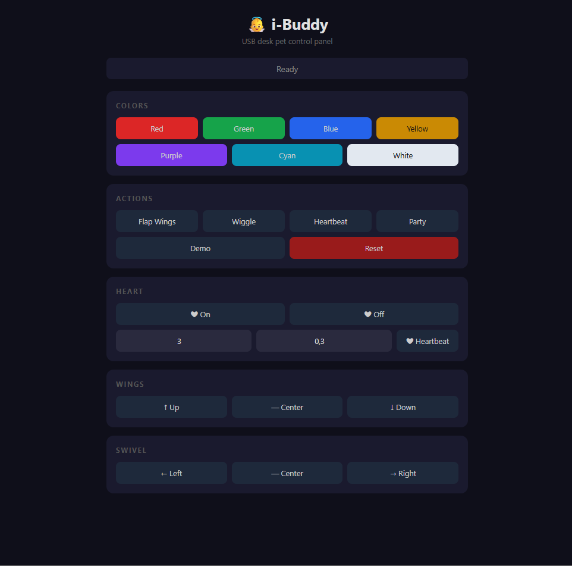

# 👼 i-Buddy — pybuddy2

> Control your i-Buddy USB desk pet from Python or your browser.



## Quick start

```python
pip install pyusb
python -c "from pybuddylib import iBuddyDevice; iBuddyDevice().doFlap()"
```

Or launch the web panel:

```bash
python http/server.py
# → http://localhost:8888
```

## Features

- **Python library** — full control of colors, wings, heart, swivel
- **Web panel** — zero-dependency HTTP server, dark theme, mobile-friendly
- **All the moves** — flap, wiggle, heartbeat, party mode, demo sequence

## Web API

| Endpoint                                | Description                                                                  |
| --------------------------------------- | ---------------------------------------------------------------------------- |
| `GET /api/color/<name>`                 | Set head color (`red`, `green`, `blue`, `yellow`, `purple`, `cyan`, `white`) |
| `GET /api/heart/<on\|off>`              | Heart light toggle                                                           |
| `GET /api/wing/<up\|down\|center>`      | Wing position                                                                |
| `GET /api/swivel/<left\|right\|center>` | Body swivel                                                                  |
| `GET /api/heartbeat`                    | Heartbeat animation (default 3×)                                             |
| `GET /api/heartbeat/<n>`                | Heartbeat n times                                                            |
| `GET /api/heartbeat/<n>/<speed>`        | Heartbeat n times with custom interval                                       |
| `GET /api/flap`                         | Flap wings (default 3×)                                                      |
| `GET /api/flap/<n>`                     | Flap n times                                                                 |
| `GET /api/flap/<n>/<speed>`             | Flap n times with custom interval                                            |
| `GET /api/wiggle`                       | Wiggle (default 3×)                                                          |
| `GET /api/wiggle/<n>`                   | Wiggle n times                                                               |
| `GET /api/wiggle/<n>/<speed>`           | Wiggle n times with custom interval                                          |
| `GET /api/party`                        | Light show + moves                                                           |
| `GET /api/demo`                         | Full demo sequence                                                           |
| `GET /api/reset`                        | Reset to neutral                                                             |

## Python library

```python
from pybuddylib import iBuddyDevice

buddy = iBuddyDevice()

buddy.doColorName(iBuddyDevice.RED, 0.5)
buddy.doFlap(3, 0.2)
buddy.doHeartbeat(5, 0.3)
buddy.doWiggle(2, 0.15)
buddy.doReset()
```

## Requirements

- **Windows**: WinUSB driver via [Zadig](https://zadig.akeo.ie/) + `libusb-1.0.dll` on PATH
- **Linux**: `apt install python-usb` or `pip install pyusb`
- Python 3.10+

## Credits

Based on [pybuddy](http://code.google.com/p/pybuddy/) by Jose.Carlos.Luna and luis.peralta.
